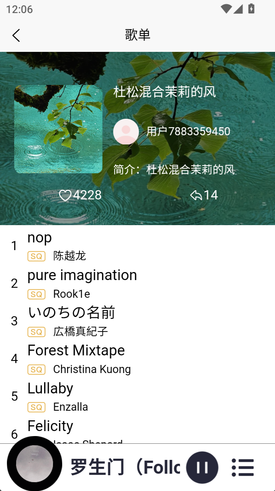
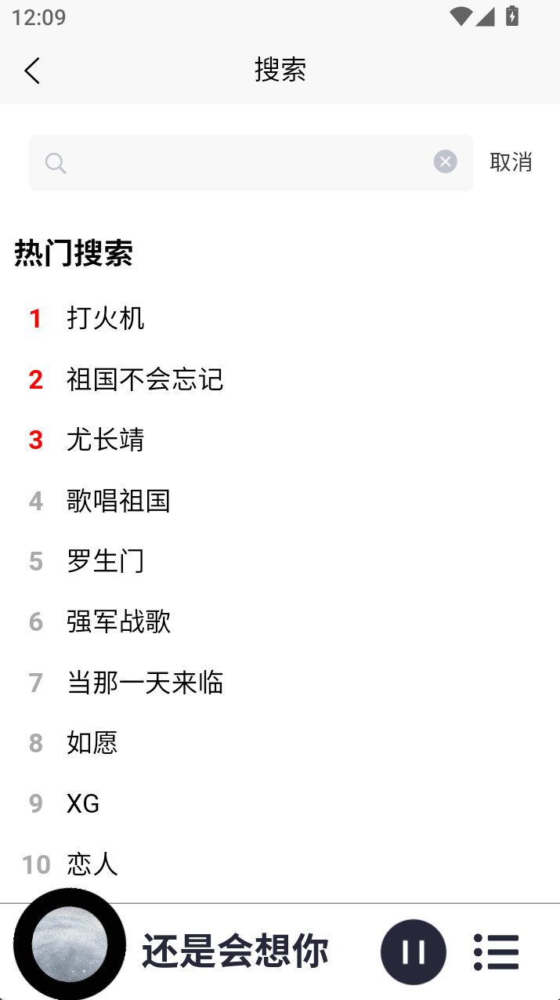
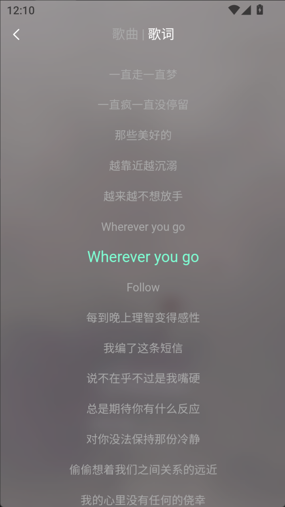

# YULEMusic

## 项目简介

YULEMusic 是一个基于 UniApp 构建的音乐播放应用，提供丰富的音乐资源和便捷的播放体验。支持 **音乐搜索**、**歌单推荐**、**播放控制** 等功能，适配 _H5端_ , _移动端_ 和 _小程序端_ 的响应式界面。

### 界面展示

<table>
  <tr>
    <td>主页面</td>
    <td>视频页面</td>
  </tr>
  <tr>
    <td></td>
    <td></td>
  </tr>
  <tr>
    <td>歌单页面</td>
    <td>音乐搜索页面</td>
  </tr>
  <tr>
    <td></td>
    <td></td>
  </tr>
  <tr>
    <td>音乐播放页面（歌曲）</td>
    <td>音乐播放页面（歌词）</td>
  </tr>
  <tr>
   <td></td>
    <td></td>
  </tr>
</table>

## 核心功能

1. **音乐搜索**：

   - 支持关键词搜索，快速找到想听的音乐。
   - 提供热门搜索推荐。

2. **歌单推荐**：

   - 根据用户喜好推荐精选歌单。
   - 支持歌单详情查看和播放。

3. **播放控制**：

   - 提供播放、暂停、上一首、下一首等基础功能。
   - 支持播放模式切换（顺序播放、随机播放、单曲循环）。
   - 支持定时关闭功能（倒计时结束歌曲自动暂停）。

4. **视频模块**：

   - 提供音乐相关视频的浏览和播放功能。

5. **响应式设计**：

   - 适配多种设备，提供一致的用户体验。

## 技术栈

1. **前端**：

   - **Vue.js**：用于构建用户界面，组件化开发。
   - **UniApp**：跨平台开发框架，支持多端发布。
   - **SCSS**：实现样式管理和复用。
